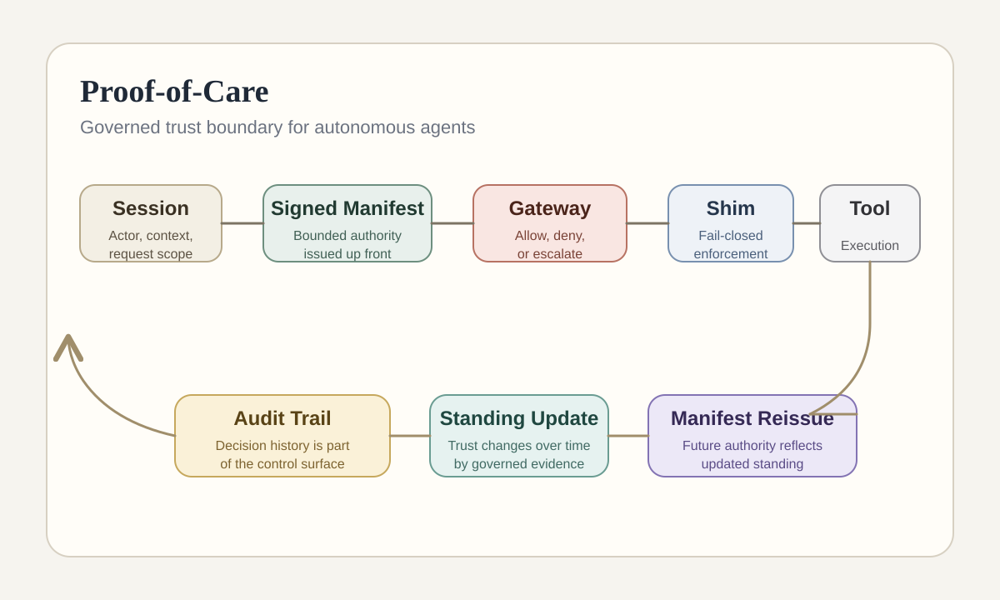

# Proof-of-Care
## Governed Trust Boundary for Autonomous Agents

Proof-of-Care is a governed execution boundary for autonomous agents.

It evaluates whether an agent may perform a requested action under current authority, standing, policy, and context conditions, then enforces that decision at the execution boundary. It should be understood as a control layer between agent intent and real-world action, not as a dashboard product or a generic orchestration framework.

> Private implementation repository. This public repository is a documentation-first technical overview of the architecture, governance model, and current prototype scope.

## At A Glance

- Category: runtime governance and execution control for autonomous agents
- Core problem: static permissions are too weak once agent behavior matters operationally
- Distinctive idea: authority is issued explicitly, evaluated deterministically, and enforced fail-closed at the action boundary
- Current maturity: serious prototype with a narrow but inspectable control surface
- Best for: recruiters, technical evaluators, and teams interested in governed autonomy



## Why This Project Exists

Many agent systems still treat trust as a static permission problem. That approach is easy to ship, but weak once an agent's behavior starts to matter operationally.

The real questions are harder:

- Can this agent perform this action right now, in this domain, under these conditions?
- What evidence supports that decision?
- What happens when confidence is low?
- How does trust expand or contract over time?
- How can policy change be evaluated safely before deployment?

Proof-of-Care exists to answer those questions with a governed execution boundary instead of a loose mix of prompts, heuristics, and post-hoc logging.

## Core Thesis

Proof-of-Care places a deterministic, auditable trust boundary between agent intent and real-world action.

Instead of relying on static permissions alone, it combines:

- signed authority issuance
- domain-specific standing
- policy and risk evaluation
- fail-closed execution behavior
- auditable decision history
- replayable policy evaluation

The result is a system where trust becomes operational rather than rhetorical.

## What Makes It Distinct

### Trust is domain-specific

An agent can earn broader capability in one domain while remaining tightly restricted in another. Filesystem behavior, network behavior, and sensitive-domain behavior do not collapse into a single trust score.

### Authority is explicit and bounded

Authority is treated as a first-class surface. A session starts from a signed capability manifest that defines what the agent may do. Nothing the agent reads during execution can expand that authority.

### The boundary fails closed

When conditions are uncertain, ambiguous, or novel, the system resolves toward restriction rather than permission. Caution is part of the design, not a last-minute patch.

### Decisions are auditable

Allow, deny, and escalation outcomes are part of the system's reasoning surface. Decision history is central to how the boundary is evaluated, tuned, and trusted.

### Policy can be replayed before it changes

Because the core decision surface is deterministic, proposed policy changes can be tested against historical behavior before they become active.

### Multi-agent authority cannot be laundered

Delegation does not mint new power. Capability flows through governed relationships and cannot be pooled upward to bypass the boundary.

## Architecture At A Glance

```text
session
  -> signed manifest
  -> gateway decision
  -> shim enforcement
  -> executor validation
  -> tool execution
  -> execution callback
  -> standing update
  -> manifest reissue
```

The system is not only deciding whether an action should happen. It is enforcing that decision through a linked control loop that can update trust and authority over time.

## Repository Guide

This overview repository is organized to make the system legible without exposing the private implementation:

- `docs/overview.md`: project framing and boundary definition
- `docs/architecture.md`: governed execution flow and component responsibilities
- `docs/authority-model.md`: signed authority and capability boundaries
- `docs/standing-model.md`: how standing changes over time
- `docs/audit-and-replay.md`: audit trail, evaluation, and policy replay concepts
- `docs/public-positioning.md`: concise public-facing positioning and shareable summary copy
- `docs/status.md`: current scope, maturity, and limitations
- `examples/`: sanitized examples of public-facing artifacts and shapes

## Current Scope

The current prototype is intentionally narrow. Its value is not breadth of capability. Its value is that the governed boundary is concrete enough to inspect and evaluate.

Prototype emphasis includes:

- runtime governance for agent actions
- signed authority issuance and validation
- standing-aware authorization behavior
- event-linked execution control
- audit-linked callback handling
- failure-path hardening

This project should be evaluated as a serious prototype control boundary, not as a finished operator product.

## Public Boundary

This repository does not publish:

- the private source code
- internal repository history
- deployment configuration
- secrets or environment details
- raw implementation notes
- full hardening details from the private build surface

The goal is to make the architecture and value legible without collapsing the boundary between a public technical overview and the private implementation itself.

## Audience

This repository is intended for:

- recruiters evaluating AI governance and agentic systems work
- technical reviewers assessing architectural depth
- collaborators interested in governed autonomy
- organizations exploring safer execution models for autonomous systems

## Available On Request

Additional technical walkthroughs, architecture discussion, and selected sanitized artifacts are available on request.
